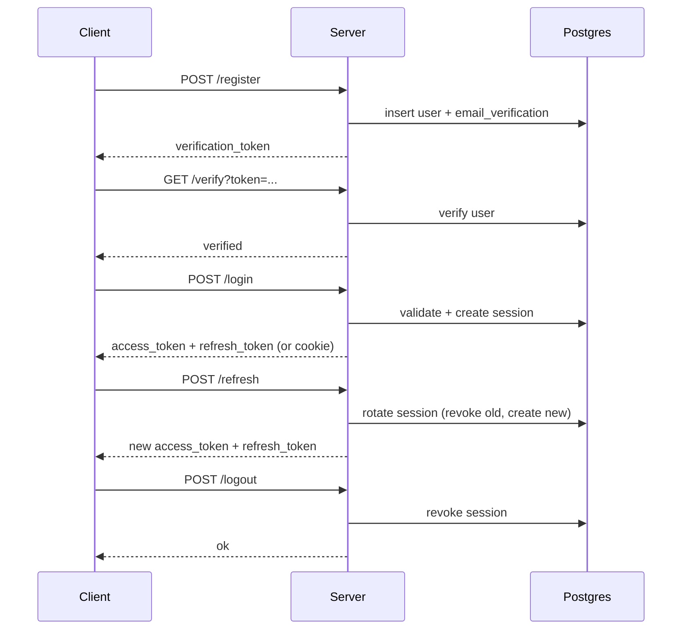

# Auth Service (Express + Postgres)

[](https://github.com/kinsleyhsu1-lang/auth-platform/actions/workflows/ci.yml)

A simple auth service with:
- Register + email verification
- Login with JWT access token
- Refresh token rotation + reuse detection
- Password reset flow
- Session cleanup
- Rate limiting
- Structured logs

## Getting Started

Grab the latest release here: [v1.0.0](https://github.com/kinsleyhsu1-lang/auth-platform/releases/tag/v1.0.0)

Quick start:
- `npm install`
- Copy `.env.example` to `.env` and set `DATABASE_URL` + secrets
- Run migrations (see Setup below)
- `npm run dev`

Quick demo:

```bash
curl -X POST http://localhost:3000/register \
  -H "Content-Type: application/json" \
  -d '{"email":"demo@test.com","name":"Demo","password":"StrongPass#123"}'

curl -X POST http://localhost:3000/login \
  -H "Content-Type: application/json" \
  -d '{"email":"demo@test.com","password":"StrongPass#123"}'

curl -H "Authorization: Bearer <access_token>" http://localhost:3000/me
```

## Setup

### 1) Install dependencies

```bash
npm install
```

### 2) Configure environment

Create `.env` in the project root (you can start from `.env.example`):

```ini
DATABASE_URL=postgres://kinsley@localhost:5432/kinsley
JWT_SECRET=replace-with-long-random-string
JWT_EXPIRES_IN=15m
JWT_ISSUER=local-dev
JWT_AUDIENCE=local-client
REFRESH_TOKEN_SECRET=replace-with-long-random-string
REFRESH_TTL_DAYS=30
VERIFY_TTL_HOURS=24
RESET_TTL_HOURS=1
LOCKOUT_THRESHOLD=5
LOCKOUT_WINDOW_MINUTES=15
LOCKOUT_DURATION_MINUTES=15
AUTH_RATE_LIMIT_WINDOW_MS=900000
AUTH_RATE_LIMIT_MAX=20
CLEANUP_INTERVAL_MS=3600000
LOG_LEVEL=info
APP_VERSION=1.0.0
SENDGRID_ENABLED=false
SENDGRID_API_KEY=
SENDGRID_FROM_EMAIL=
SENDGRID_SANDBOX_MODE=false
APP_BASE_URL=http://localhost:3000
USE_REFRESH_COOKIE=false
REFRESH_COOKIE_NAME=refresh_token
COOKIE_SECURE=false
COOKIE_SAMESITE=lax
EXPOSE_REFRESH_TOKEN=true
CSRF_COOKIE_NAME=csrf_token
CSRF_HEADER_NAME=x-csrf-token
```

### 2b) Production hardening

Create `.env.production` and use stricter values:

```ini
COOKIE_SECURE=true
COOKIE_SAMESITE=strict
AUTH_RATE_LIMIT_WINDOW_MS=900000
AUTH_RATE_LIMIT_MAX=10
LOG_LEVEL=info
```

If you run behind a proxy/load balancer, set `TRUST_PROXY=true` and configure Express to trust the proxy.

### 3) Run migrations

```bash
psql "$DATABASE_URL" -f ./migrations.sql
psql "$DATABASE_URL" -f ./migrations_step2.sql
psql "$DATABASE_URL" -f ./migrations_step3.sql
psql "$DATABASE_URL" -f ./migrations_step4.sql
psql "$DATABASE_URL" -f ./migrations_step6.sql
```

### 4) Start the server

```bash
npm run dev
```

## Auth Flow (curl)

### Register

```bash
curl -X POST http://localhost:3000/register \
  -H "Content-Type: application/json" \
  -d '{"email":"user@test.com","name":"User","password":"StrongPass#123"}'
```

### Verify

```bash
curl "http://localhost:3000/verify?token=<verification_token>"
```

### Login

```bash
curl -X POST http://localhost:3000/login \
  -H "Content-Type: application/json" \
  -d '{"email":"user@test.com","password":"StrongPass#123"}'
```

If `USE_REFRESH_COOKIE=true`, a secure httpOnly cookie is set for refresh tokens. You can set `EXPOSE_REFRESH_TOKEN=false` to avoid returning the refresh token in the JSON body.

### Me

```bash
curl -H "Authorization: Bearer <access_token>" http://localhost:3000/me
```

### Refresh (rotates refresh token)

```bash
curl -X POST http://localhost:3000/refresh \
  -H "Content-Type: application/json" \
  -d '{"refresh_token":"<refresh_token>"}'
```

If `USE_REFRESH_COOKIE=true`, include the CSRF header:

```bash
curl -X POST http://localhost:3000/refresh \
  -H "Content-Type: application/json" \
  -H "x-csrf-token: <csrf_token>" \
  -d '{}'
```

### Logout (revokes refresh token)

```bash
curl -X POST http://localhost:3000/logout \
  -H "Content-Type: application/json" \
  -d '{"refresh_token":"<refresh_token>"}'
```

If `USE_REFRESH_COOKIE=true`, include the CSRF header:

```bash
curl -X POST http://localhost:3000/logout \
  -H "Content-Type: application/json" \
  -H "x-csrf-token: <csrf_token>" \
  -d '{}'
```

### Password Reset

```bash
# Request reset
curl -X POST http://localhost:3000/request-reset \
  -H "Content-Type: application/json" \
  -d '{"email":"user@test.com"}'

# Reset
curl -X POST http://localhost:3000/reset \
  -H "Content-Type: application/json" \
  -d '{"token":"<reset_token>","new_password":"NewStrongPass#123"}'
```

If `SENDGRID_ENABLED=true`, the reset token is emailed and not returned in the response.

### Reset Page

Open the reset link in a browser:

```
http://localhost:3000/reset?token=<reset_token>
```

## Tests

```bash
npm test
```

With coverage:

```bash
npm run test:coverage
```

## Lint

```bash
npm run lint
```

## Status

```bash
curl http://localhost:3000/status
```

## Release

See `CHANGELOG.md` and `RELEASE.md` for versioning and release checklist.

## CI Secrets (GitHub Actions)

Add these repository secrets for CI if you want to test with real SendGrid:\n\n- `SENDGRID_API_KEY`\n- `SENDGRID_FROM_EMAIL`

## Notes

- Refresh tokens are stored as HMAC-SHA256 hashes.
- Reusing a revoked refresh token revokes all active sessions for that user.
- The test suite uses the exported Express app and does not require a running server.

## Flow Diagram


